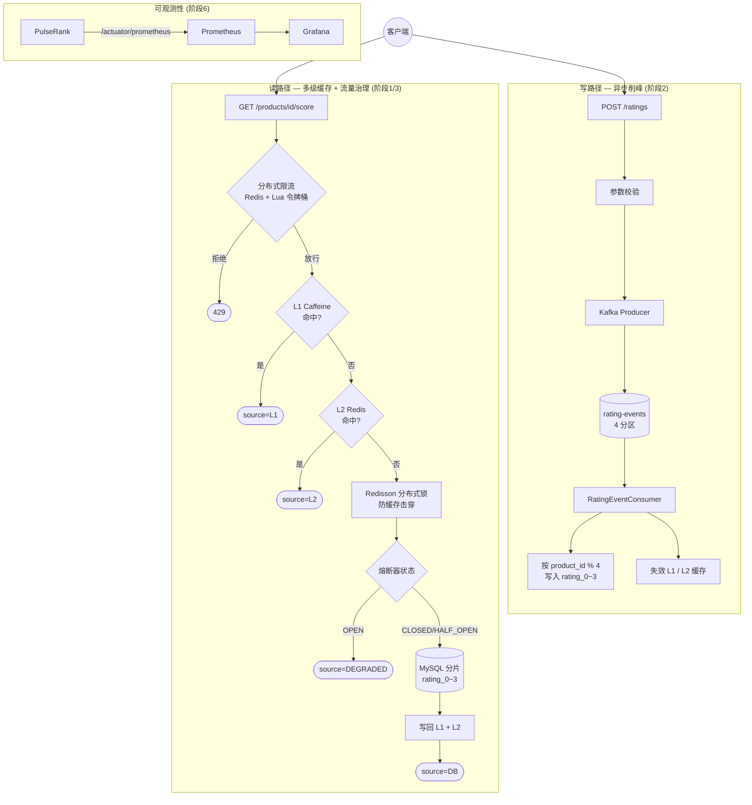

# PulseRank

高并发实时评分聚合系统 —— 一个求职作品集项目，主题是"高并发服务稳定性"。

以"商品评分实时聚合"为业务场景（用户提交评分 → 实时计算平均分/评分数），逐阶段引入高并发场景下的稳定性技术点：多级缓存、分布式锁防击穿、异步削峰、自研限流熔断组件、JVM profiling、全链路压测与混沌工程、可观测性与内核调优。**六个阶段全部完成**，每一步都有真实压测数据和可复现的验证过程，[docs/](docs) 目录下每个阶段一篇文档，记录了做了什么、为什么这样做、怎么验证的——包括几次真实的版本冲突、踩过的坑，以及诚实汇报"没达到预期效果"的部分。

## 架构



## 核心结果一览

| 阶段 | 做了什么 | 关键数据 / 结论 |
|---|---|---|
| [阶段1](docs/阶段1.md) 多级缓存 + 分布式锁 | L1(Caffeine)/L2(Redis) 多级缓存，Redisson 锁防缓存击穿，手写取模分表 | 无缓存 QPS 1345/P99 190ms → 多级缓存 QPS 5693/P99 41ms，**提升 4.2x，P99 降 78%** |
| [阶段2](docs/阶段2.md) Kafka 异步削峰 | 写入只发消息立即返回，落库交给消费者异步完成 | 同步写库 QPS 1249/P99 135ms → 异步 QPS 2727/P99 73ms，**提升 2.2x**，10 万+ 条积压零丢失零重复 |
| [阶段3](docs/阶段3.md) 自研流量治理组件 | 分布式令牌桶限流、熔断状态机、热点探测，全部手写不用 Sentinel | 真实停 MySQL 验证熔断：5 次失败后跳闸，之后 **~10ms 快速失败**；50 并发打向失效缓存，DB 只被真正查询 **1 次** |
| [阶段4](docs/阶段4.md) JVM 深度优化 | JFR profiling 对比 G1/ZGC/固定堆三种配置 | **诚实结论**：GC 占比不到 1% 不是瓶颈；profiling 意外发现分配热点第一名是限流器不是缓存查询 |
| [阶段5](docs/阶段5.md) 混沌工程 | 真实 `docker stop` 断 Redis/MySQL/Kafka，不是代码模拟异常 | **真的挖出 2 个 bug 并修复**：限流依赖故障导致 500（改 fail-open）、Kafka 重试导致评分重复插入数据库（更严重，已修复） |
| [阶段6](docs/阶段6.md) 可观测性 + 内核调优 | Prometheus+Grafana、容器化、真实 Linux 内核参数实验 | 文件描述符上限 100→崩溃、1024→正常，清晰 before/after；连接队列实验**如实记录未复现预期现象**及原因 |

## 技术栈

- Java 21 + Spring Boot 3.5.7 + Maven，数据访问用 JdbcTemplate（见阶段1 为什么放弃 JPA）
- MySQL 8 + Redis + Kafka（Docker Compose 本地起，Kafka 用 KRaft 单节点模式，不需要 Zookeeper）
- Caffeine（L1 本地缓存）+ Redisson（L2 Redis 缓存 / 分布式锁 / 防缓存击穿）
- 手写按 `product_id` 取模的分表路由（`rating_0`～`rating_3`，为什么没用 ShardingSphere 见阶段1 文档）
- 自研分布式流量控制组件（`com.pulserank.governance`）：Redis+Lua 实现的分布式令牌桶限流、熔断状态机、热点探测自动延长本地缓存 TTL
- Prometheus + Grafana 可观测性（含自定义业务指标）+ Dockerfile 容器化

## 项目进度

- [x] [阶段0](docs/阶段0.md)：脚手架 + 核心链路打通
- [x] [阶段1](docs/阶段1.md)：多级缓存 + 分布式锁防击穿 + 分库分表
- [x] [阶段2](docs/阶段2.md)：Kafka 异步削峰
- [x] [阶段3](docs/阶段3.md)：自研分布式流量控制组件
- [x] [阶段4](docs/阶段4.md)：JVM 深度优化
- [x] [阶段5](docs/阶段5.md)：全链路压测 + 混沌工程
- [x] [阶段6](docs/阶段6.md)：Linux/TCP 调优 + 可观测性

## 本地运行

```bash
docker compose up -d          # 启动 MySQL + Redis + Kafka + Prometheus + Grafana
mvn clean package -DskipTests
java -jar target/pulserank-0.0.1-SNAPSHOT.jar   # 默认端口 8081
```

- Grafana 面板：http://localhost:3000 （账号 admin/admin，仪表盘 "PulseRank" 已自动配好）
- Prometheus：http://localhost:9090
- 应用指标：http://localhost:8081/actuator/prometheus

也可以用仓库根目录的 `Dockerfile` 把应用打成镜像（阶段6 用它做过 Linux 内核参数调优实验）：

```bash
docker build -t pulserank:latest .
```

## API

- `POST /api/ratings` —— 提交评分，body: `{"productId": 1001, "userId": 1, "score": 5}`（score 范围 1-5），返回 `202 Accepted`，写入通过 Kafka 异步完成
- `GET /api/products/{productId}/score` —— 查询某商品的实时平均分与评分数，响应带 `source` 字段标出命中了哪一层（`L1`/`L2`/`DB`/`DEGRADED`熔断降级），挂了分布式限流，超限返回 `429`

## License

[MIT](LICENSE)
